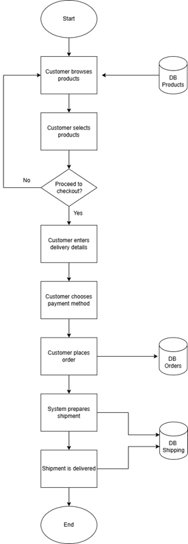
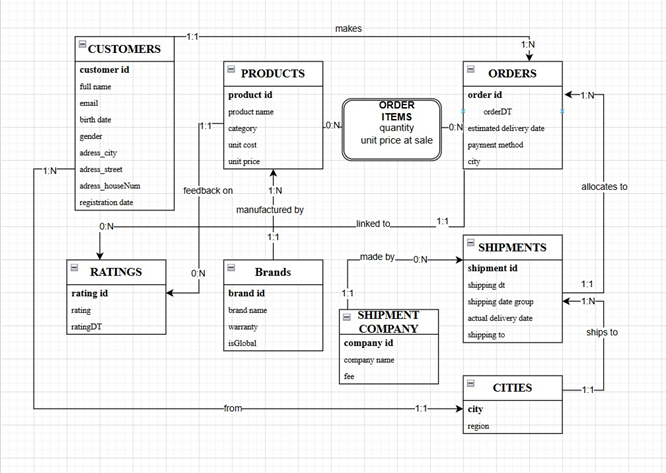
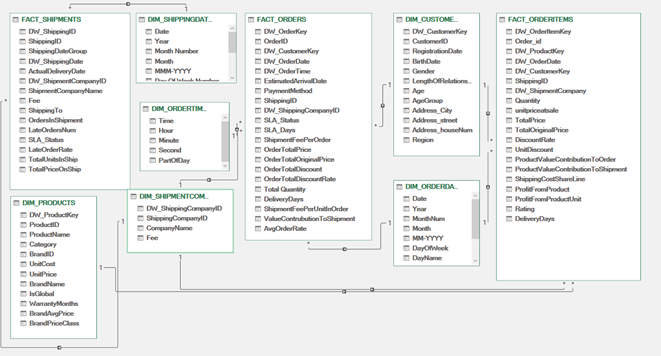
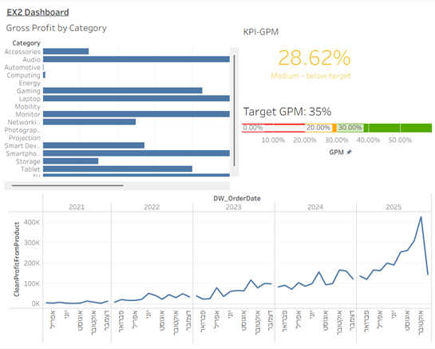
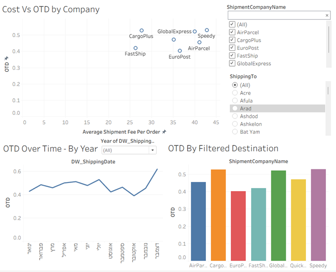
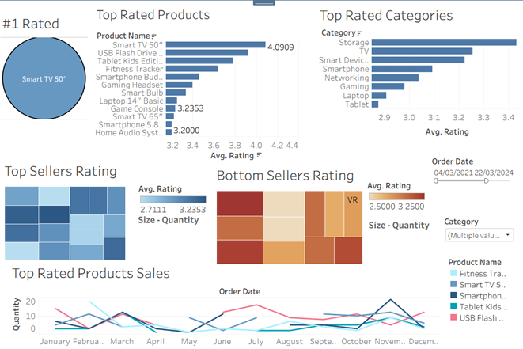
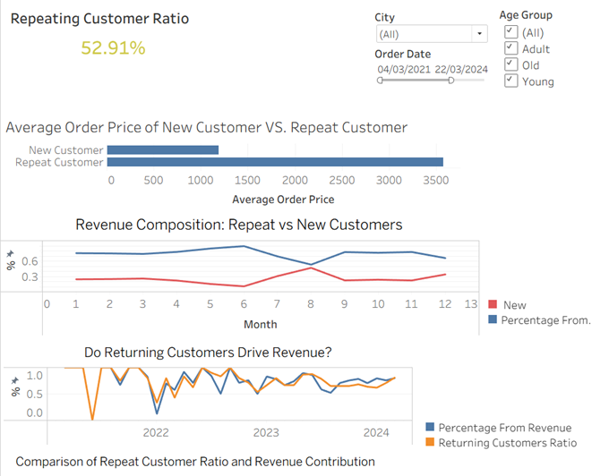
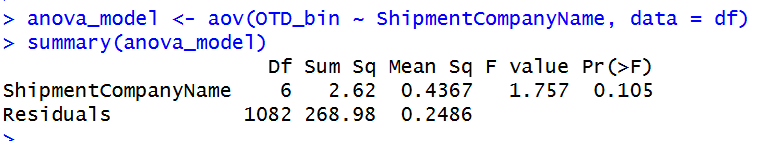
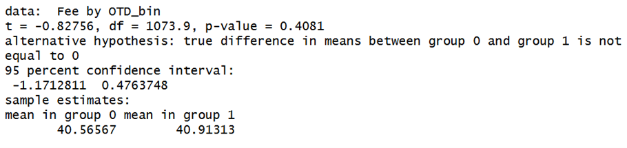
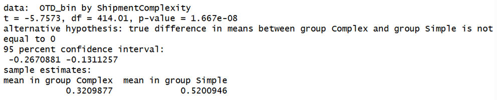

# Business-Analytics-Project
Full BI solution for e-commerce: from data modeling (ERD &amp; Star Schema) to dashboards, OLAP analysis, and statistical decision support.

# E-Commerce BI & Data Warehouse Project

## 📊 Project Overview
This project presents a full end-to-end Business Intelligence (BI) solution for an e-commerce company specializing in electronics.

The project covers the entire BI lifecycle:
- Business process analysis  
- Data modeling (ERD & Data Warehouse)  
- KPI definition and calculation  
- Dashboard development (Tableau)  
- OLAP analysis  
- Statistical hypothesis testing  

The goal is to support data-driven decision-making across operational, tactical, and strategic levels.

---

## 🏢 Business Process

The core business flow includes:
Customer → Order → Shipment → Delivery → Rating  

📸 **Business Process Diagram:**  

---

## 🗂️ Data Model

### 🔹 ERD (Operational Database)

Main entities:
- Customers  
- Orders  
- Order_Items  
- Products  
- Shipments  
- Shipment_Companies  
- Ratings  
- Cities  

📸 **ERD Diagram:**  

👉 **Full ERD schema (tables & fields):**  
[View detailed ERD](data_model/erd.md)

---

### ⭐ Data Warehouse (Star Schema)

Fact Tables:
- FACT_ORDERITEMS  
- FACT_ORDERS  
- FACT_SHIPMENTS  

Dimension Tables:
- DIM_CUSTOMERS  
- DIM_PRODUCTS  
- DIM_SHIPMENT_COMPANIES  
- DIM_DATES  
- DIM_TIMES  

📸 **Star Schema Diagram:**  

👉 **Full Data Warehouse schema:**  
[View detailed Star Schema](data_model/star_schema.md)

---

## 📈 Key Performance Indicators (KPIs)

- **GPM (Gross Profit Margin)** – profitability  
- **OTD (On-Time Delivery)** – delivery performance  
- **RPR (Repeat Purchase Rate)** – customer loyalty  
- **PRR (Positive Review Rate)** – customer satisfaction  
- **Revenue from Returning Customers** – strategic growth indicator  

---

## 📊 Dashboards & Reports

### 🔹 Strategic Dashboard – GPM Analysis
Provides a high-level overview of profitability:
- KPI vs target  
- Profit by category  
- Drill-down to products  
- Time trend analysis  

📸  

---

### 🔹 OLAP Dashboard – Shipping Performance
Interactive analysis of logistics performance:
- OTD by company  
- OTD over time  
- OTD by location  
- Cost vs OTD (scatter analysis)  

📸  

---

### 📑 Business Reports

#### Tactical Report – Product Quality & Sales
Supports short-term decisions:
- PRR analysis  
- Product performance  
- Customer perception vs sales  

📸  

---

#### Strategic Report – Returning Customers
Supports long-term strategy:
- Revenue from returning customers  
- Customer segmentation  
- Growth analysis  

📸  

---

## 🔍 Statistical Analysis

### 1️⃣ ANOVA – OTD by Shipping Company  
Tested differences in delivery performance across companies  

📸  

➡ Result: No statistically significant difference  

---

### 2️⃣ T-Test – Shipping Cost vs SLA  
Tested whether higher cost improves delivery performance  

📸  

➡ Result: No significant difference  

---

### 3️⃣ T-Test – Simple vs Complex Shipments  
Compared delivery performance based on shipment complexity  

📸  

➡ Result: Significant difference  
➡ Complex shipments perform worse  

---

## 🧠 Key Insights

- Delivery performance is not dependent on shipping company  
- Higher cost does not guarantee better service  
- Shipment complexity significantly impacts delivery performance  
- Profitability varies across product categories  

---

## 🛠️ Tools Used

- Excel (Data preparation & Data Warehouse)  
- Tableau (Dashboards & OLAP analysis)  
- Data Modeling (ERD, Star Schema, SCD Type 2)  
- Statistical Analysis (ANOVA, T-tests)  

---

## 📁 Repository Structure

/data_model → ERD & Star Schema detailed schemas
/images → Diagrams, dashboards, reports
/data → Excel datasets
/tableau → Tableau workbooks
/docs → Full project documentation

---

## 📌 Notes

- This project was developed as part of an academic BI course  
- The project demonstrates end-to-end BI capabilities from data modeling to advanced analytics  

---

## 👥 Contributors

- Yarden Moshe  
- Tal Magled  
- Daniel Gabay
